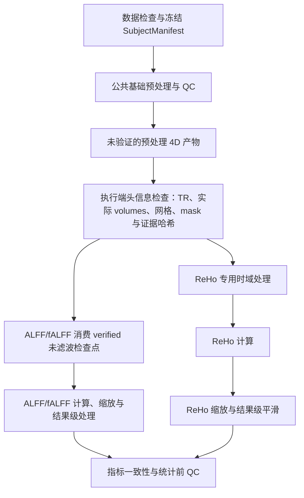

# 静息态 fMRI Skill 层架构

- 状态：Skill Registry、Resolver、Validator、Compiler、`WorkflowFactory`/`ToolRuntime`、9 个运行时 Skill 与 16 个磁盘参数 schema 已实现（其中 10 个为 Phase 10–17 契约预览包）；公共 Worker 默认 Mock，并提供受控 MATLAB 路由
- 决策日期：2026-08-06
- 关联 ADR：[0001：Skill 编译为受控 Workflow](../adr/0001-skill-compiles-to-workflow.md)
- 实施计划：[0001：fMRI Skill 层 MVP](../plans/0001-skill-layer-mvp.md)

## 1. 定义与目标

本项目中的运行时 `Skill` 是一个版本化、声明式、可审核的科研能力配方。它描述“某类静息态 fMRI 任务在什么数据上适用、需要哪些参数、步骤满足什么顺序、产生什么结果、经过哪些 QC”，再由确定性编译器生成可审批的工作流计划。

这里的 Skill：

- 不是 Codex 的个人 Skill 或 `SKILL.md` 扩展包。
- 不是 `.agents/*.md` 中的开发协作角色。
- 不是一段提示词、任意 MATLAB 文本或 Shell 脚本。
- 不是 Workflow 状态机，也不直接执行 Tool。

目标：

- 用机器可校验的方式表达 ALFF/fALFF、ReHo 等指标不同的预处理顺序。
- 把科研参数、适用条件、证据、版本、产物和 QC 门禁放在同一份协议中。
- 让 Agent 推荐和解释方案，但不能自由拼装或直接执行科研流程。
- 同一数据集计算多个指标时，安全复用公共步骤并形成明确的数据依赖和中间产物检查点。
- 每次运行绑定确定的 Skill、输入清单、参数、工具和软件版本。

非目标：

- 首期不建设通用 Skill 市场、远程 Skill 下载或任意第三方代码加载。
- 不允许 Skill 绕过审批、路径策略、Workflow 或 MATLAB Executor。
- 不用一个“万能 Skill”允许任意排列预处理步骤。
- 不静默固化课题尚未确认的频段、平滑核、头动阈值或统计方法。

## 2. 组件边界

| 组件 | 负责 | 不负责 |
| --- | --- | --- |
| Agent | 理解意图、推荐候选 Skill、收集缺失参数、解释计划与结果 | 生成自由 MATLAB、修改状态、自动排除受试者、替用户决定科学方案 |
| Skill | 适用条件、参数 schema、步骤约束、能力需求、产物与 QC 契约 | 执行工具、保存运行状态、携带任意代码 |
| fMRI Domain | 数据与指标语义、Artifact 类型、科学约束、QC 规则 | HTTP、进程执行、数据库适配 |
| Workflow | 审批后的运行状态迁移、重试、恢复、取消和运行期 QC gate | 管理计划审批、选择科学默认值、实现影像算法 |
| Tool | 一个边界清晰、可测试的确定性操作 | 整条业务流程、任意状态推进 |
| Execution | 把批准后的 ToolCall 转为受控 Job 并注册产物 | 解释科研意图或更改 Skill |
| Plugin | 打包和注册 Skill、Workflow、Tool 与兼容信息 | 绕过 Registry、Policy、Approval 或 Workflow |

Skill 可以声明 `workflow_template_ref` 和 `required_capabilities`，但不能直接“调用工作流”。只有编译完成并经批准的 `SkillPlan` 才能实例化 `WorkflowInstance`。

## 3. 目标执行数据流


图中从请求到编译、计划 revision 和人工审批的控制面已经接入应用服务。审批后的 DAG→Tool→Executor 路径由 `WorkflowFactory` 冻结并由 `ToolRuntime` 遍历；Mock 和 MATLAB 适配器都必须通过同一份冻结步骤合同。真实执行还受环境探测、配置开关和逐次确认保护。

运行时状态只有一个真源：`WorkflowInstance`。可以保存 Skill 与运行的关联记录，但不得建立第二套可变的 `SkillRun` 状态机。

## 4. 核心模型

### 4.1 SkillSpec

`SkillSpec` 是 Git 管理的机器事实来源，建议使用 YAML 或 JSON，并由 JSON Schema 校验。

| 字段组 | 主要字段 | 说明 |
| --- | --- | --- |
| 身份 | `skill_id`、`version`、`kind`、`title`、`status` | ID 稳定，版本使用 SemVer；首期状态为 `draft`、`reviewed`、`deprecated` |
| 适用性 | `applicability` | 模态、volume/surface、空间、输入处理谱系、所需元数据 |
| 兼容性 | `compatibility` | MATLAB、SPM、DPABI、适配器版本约束 |
| 输入输出 | `input_artifact_contracts`、`output_artifact_contracts` | 使用带类型、空间、处理谱系的 Artifact，不只传文件路径 |
| 参数 | `parameter_schema_ref` | 类型、单位、范围、是否必填、允许来源和说明 |
| 能力 | `required_capabilities`、`workflow_template_ref` | 引用能力和工作流模板，不绑定自由文本命令 |
| 顺序 | `steps`、`step_constraints` | `needs`、`before`、`after`、`requires`、`forbids` 和受限条件表达式 |
| QC | `qc_requirements` | 运行前、指标后、进入统计前的阻断或警告门禁 |
| 审批 | `approval_hints` | 哪些参数或步骤变化需要重新确认 |
| 证据 | `evidence_refs`、`known_limitations` | 本机源码、方法文献和已知限制 |
| 审核 | `reviewed_by`、`reviewed_at`、`supersedes` | 方法学和工程审核记录 |
| 完整性 | `content_hash` | 规范化内容哈希，防止审批后内容漂移 |

禁止字段包括任意 Shell、任意 MATLAB 程序文本、未经校验的绝对输出路径和直接状态迁移指令。

### 4.2 SkillRequest 与 SkillResolution

`SkillRequest` 表达用户目标，不表达执行细节：

```text
project_id
dataset_ref
requested_metrics
requested_primary_outputs
study_protocol_ref
user_overrides
execution_backend
```

`SkillResolver` 根据数据画像、已安装环境和研究方案筛选精确版本，返回候选、选择理由、缺失参数、冲突和不适用原因。出现多个科学上不同但都合法的方案时必须交给用户选择，不能按排序静默决定。

### 4.3 SkillPlan

`SkillPlan` 是某次具体项目中已解析、可预览、不可变的计划：

```text
plan_id
project_id
dataset_ref
subject_manifest_ref + input_manifest_hash
selected_skill_refs + content_hashes
resolved_parameters + parameter_provenance
environment_snapshot
step_dag
resolved_tool_refs
workflow_definition_ref
artifact_expectations
qc_gates
approval_requirements
warnings / unresolved_questions
plan_hash
```

参数来源至少区分 `user`、`study_protocol`、`dataset_metadata` 和 `reviewed_preset`。科学参数不能只有值而没有来源。

计划获批后不得原地修改。输入清单、参数、Skill、Tool、工作流模板或环境锁发生变化时，必须生成新 revision，并使旧审批失效。

### 4.4 计划生命周期与审批

`SkillPlan` 内容不携带可变 `status`。应用服务使用单独的 `PlanRevision(revision_id, plan_id, plan_hash, lifecycle_state, version)` 管理 `draft`、`validating`、`awaiting_approval`、`approved` 和 `superseded`，并以追加式 `ApprovalRecord` 绑定 `plan_hash + input_manifest_hash`。修改计划内容时创建新的 SkillPlan 和 PlanRevision，而不是改写已有内容。

计划生命周期是运行前控制面，不是第二套运行状态机。只有 `approved` revision 可以创建 WorkflowInstance。

### 4.5 运行关联

运行关联只保存计划、工作流、审批、版本锁、事件、产物和 provenance 引用，不拥有独立状态。若为了查询保存 `status`，它必须是 `WorkflowInstance` 状态的只读投影。

## 5. 解析、校验、编译与执行

1. `SkillLoader` 加载内置 SkillSpec，进行 schema、路径和内容哈希检查。
2. `SkillRegistry` 按 ID、版本、状态和能力建立只读索引。
3. `SkillResolver` 结合 `SkillRequest`、DatasetProfile 与 EnvironmentSnapshot 选择精确版本。
4. `SkillValidator` 依次执行结构、兼容性、数据适用性、科学约束、安全和产物合同校验。
5. `SkillCompiler` 合并公共节点，生成带类型 Artifact 的 DAG，并检查循环、顺序冲突、互斥参数和缺失能力。
6. 编译器把 capability 绑定到已注册且允许使用的 `tool_id@version`，生成不可变 `SkillPlan`。
7. 前端展示计划、参数来源、数据依赖、警告、QC gate 和预计产物；应用服务推进 PlanRevision，并用 ApprovalRecord 记录用户对 `plan_hash + input_manifest_hash` 的批准。
8. 目标路径由 `WorkflowFactory` 从批准计划创建 `WorkflowInstance`。
9. 目标路径由 `WorkflowEngine` 按 DAG 请求 Tool 执行，再由 ToolRuntime 与 Executor 完成确定性调用并注册事件和 Artifact。
10. 目标路径中的 QC gate 决定进入人工审核、继续、失败或恢复；Agent 只能解释，不能越过 gate。

当前实现已经覆盖步骤 1–10 的控制面与 Mock DAG 执行；MATLAB/DPABI 真实 smoke 用于证明步骤级证据、实际文件和统计闭环，不由 Mock 结果替代。

建议接口：

```text
SkillLoader.load(source) -> SkillSpec
SkillRegistry.register(spec)
SkillRegistry.resolve(skill_id, version_constraint) -> SkillSpec
SkillResolver.resolve(request, dataset, environment) -> SkillResolution
SkillValidator.validate_spec(spec) -> ValidationReport
SkillCompiler.compile(resolution) -> SkillPlan
SkillValidator.validate_plan(plan) -> ValidationReport
WorkflowFactory.instantiate(approved_plan) -> WorkflowInstance
```

不要实现能够运行 MATLAB 的 `SkillRuntime`。

## 6. 步骤顺序与 Skill 组合

### 6.1 使用偏序 DAG，不使用自由步骤列表

每个节点至少声明 `step_id`、`capability_ref`、`needs`、`consumes`、`produces`、`parameter_bindings`、`condition`、重试和审批引用。`condition` 只能使用受限、可静态检查的表达式；不允许嵌入 Python、MATLAB 或模板代码。

### 6.2 用 Artifact 谱系防止错误复用

Artifact 合同除了格式，还要记录：

- volume 或 surface。
- native 或标准空间、模板和体素尺寸。
- 是否重采样、回归、时域滤波、空间平滑和 scrubbing。
- 掩膜及其空间。
- 频段、邻域、缩放类型和其他影响指标含义的参数。
- 输入清单和生成步骤哈希。

`ArtifactLineage.metadata_verified` 默认且明确为 `false`。只有执行端实际读取产物头信息后，才能同时登记 `metadata_verified=true`、`tr_seconds`、实际 `volume_count` 和 `metadata_evidence_hash`；编译器、客户端输入或 Mock 产物不得自行把“期望元数据”伪装成已验证事实。指标参数中的 TR 必须与该 lineage 一致。

这里的 `volume_count` 是指标实际消费时仍保留的 4D volumes 数，而不是扫描计划中的名义时间点。频率分辨率按 `1 / (TR * volume_count)` 检查。删除初始 volumes 后可以从已核验头信息确定数量；CUT scrubbing 后的保留数只能从实际产物得到，未知时必须阻断同阶段指标规划。

只有 Artifact 类型、空间、处理谱系和锁定参数都兼容，多个 Skill 才能合并公共节点；否则必须分支或失败关闭。

### 6.3 组合规则

- 首期提供经过审核的端到端组合，不允许 Agent 任意排列节点。
- 可复用公共预处理 Skill 与指标 Skill，但编译时必须展开并锁定全部版本。
- 嵌套 Skill 不在运行时互相调用；编译后只有一个扁平 DAG 和一个 WorkflowInstance。
- 冲突不通过“后声明覆盖前声明”解决，必须返回可解释的 ValidationIssue。

## 7. ALFF/fALFF 与 ReHo 的首期设计

### 7.1 本机 DPABI V8.2 事实基线

本节只描述已经从本机 `DPABI_V8.2_240510` 源码确认的行为，不把软件行为自动升级为课题的科学默认值。

`DPARSFA_run.m` 中相关步骤的固定相对位置为：

```text
可选 Covremove AfterRealign
→ 可选 Filter BeforeNormalize
→ Normalize functional
→ 可选 Smooth OnFunctionalData
→ Detrend
→ 可选 Covremove AfterNormalize
→ ALFF + fALFF
→ 可选 Filter AfterNormalize
→ 可选 Scrubbing AfterPreprocessing
→ ReHo
→ 可选 Normalize Results
→ 可选 Smooth OnResults
```

DPABI V8.2 源码证据（安装根目录由本地环境配置提供，不写入仓库）：

- ALFF/fALFF：`DPABI_V8.2_240510/DPARSF/DPARSFA_run.m:3924`。
- AfterNormalize 滤波：`DPABI_V8.2_240510/DPARSF/DPARSFA_run.m:3975`。
- AfterPreprocessing scrubbing：`DPABI_V8.2_240510/DPARSF/DPARSFA_run.m:4012`。
- ReHo 与专用平滑：`DPABI_V8.2_240510/DPARSF/DPARSFA_run.m:4055`、`DPABI_V8.2_240510/DPARSF/DPARSFA_run.m:4084`。
- 结果平滑：`DPABI_V8.2_240510/DPARSF/DPARSFA_run.m:4950`。

因此当 `Filter.Timing='AfterNormalize'` 时，ALFF/fALFF 在滤波前、ReHo 在滤波后；当使用 `BeforeNormalize` 时，ALFF/fALFF 会接收已滤波输入，Skill 必须阻断或要求显式协议确认。后处理 scrubbing 位于 ALFF 后、ReHo 前，不能声称它已经影响 ALFF/fALFF。头动坏点回归量是另一机制，不得与此 scrubbing 混为一谈。

### 7.2 指标差异

| 项目 | ALFF/fALFF Skill | ReHo Skill |
| --- | --- | --- |
| DPABI 开关 | `IsCalALFF`；高级入口一次同时生成 ALFF 和 fALFF | `IsCalReHo` |
| 核心参数 | 与 verified lineage 一致的 TR、频段、typed 脑掩膜 | 与 verified lineage 一致的 TR、`CalReHo.ClusterNVoxel`、计算空间、滤波状态、typed 脑掩膜 |
| 时域滤波 | 标准 fALFF 输入禁止预先带通；频段由频谱计算参数表达 | 若方案要求滤波，必须在 ReHo 前完成 |
| 空间平滑 | 输入平滑与结果图平滑是不同协议，必须显式选择且不能重复 | ReHo 计算前必须是未平滑时间序列；需要时只平滑结果图 |
| 输出 | `ALFFMap/mALFFMap/zALFFMap`、`fALFFMap/mfALFFMap/zfALFFMap` | `ReHoMap/mReHoMap/zReHoMap` |
| 特有校验 | `0 <= low < effective_high <= Nyquist`、实际保留点数支持的频率分辨率、fALFF 无预滤波 | 实际保留点数支持的频率分辨率、邻域只能为 7/19/27、输入未平滑、物理邻域可比、只平滑一次 |

领域字段到本机 Cfg 的映射必须避免名称反直觉造成颠倒：

```text
frequency_band.low_hz  -> Cfg.CalALFF.AHighPass_LowCutoff
frequency_band.high_hz -> Cfg.CalALFF.ALowPass_HighCutoff
cluster_voxels          -> Cfg.CalReHo.ClusterNVoxel
```

`y_alff_falff` 把 Cfg 的高截止值 `0` 当作“直到 Nyquist”的软件哨兵值，见 `DPABI_V8.2_240510/DPARSF/Subfunctions/y_alff_falff.m:104`。首期领域模型不暴露这个哨兵值，常规频段必须提供正数上界。

`IsCalALFF` 在高级入口中调用 `y_alff_falff` 同时生成两套结果。Skill 可以声明哪类结果是主终点，但不能虚构独立的高级 fALFF 执行开关。首期对 raw、`m*` 和 `z*` 的 ALFF/fALFF/ReHo 统一强制使用已登记、与功能像网格匹配的 typed 脑掩膜；适配器必须投影显式 `MaskFile`，不允许退回 DPARSFA 的隐藏 `Default` 掩膜。`SmoothReHo=1` 还需校验 `Smooth.FWHM` 与全局 OnResults 平滑，避免缺失文件或重复平滑。

### 7.3 推荐的数据依赖与检查点形态

以下只展示首期组合结构，不提供未经课题确认的数值默认值：



该图表达 Artifact 数据依赖，不要求启动多个 DPABI 作业。`preprocess_common` 只能先产生 unverified 产物；`verify_preprocessed_metadata` 必须在指标节点之前读取实际头信息并登记证据，指标节点只消费 verified checkpoint。只要 adapter 能证明 ALFF/fALFF 消费滤波前检查点、ReHo 消费滤波后检查点，同一个 `DPARSFA_run` 线性 Workflow 就是合法的编译结果；需要不同空间、去噪或其他不兼容输入时才拆为显式分支。

同一 DAG 的预审可以使用 `expected_time_points - dummy_scans` 检查冻结方案，但它仍只是运行时核验目标，不产生 verified lineage。若 ReHo 前启用 CUT scrubbing，实际保留 volume 数在运行前未知，系统必须先完成预处理/头信息登记，再由用户选择该 verified Artifact 创建第二阶段指标计划；不得估算删帧数或直接信任原始 manifest。

当前已冻结的 9 个运行时 Skill ID：

- `rsfmri.dataset.inspect`
- `rsfmri.preprocess.common`
- `rsfmri.metric.alff_falff`
- `rsfmri.metric.reho`
- `rsfmri.pipeline.alff_reho_combined`
- `rsfmri.qc.pre_statistics`
- `rsfmri.statistics.ttest`
- `rsfmri.statistics.fdr`
- `rsfmri.statistics.grf`

这些 ID 已在内置 `SkillSpec` 与运行时 Registry 中冻结。仓库根目录的 6 个磁盘 Skill 包按用户工作流聚合表达数据检查、预处理、ALFF/fALFF、ReHo、QC 和统计设计；统计磁盘包覆盖 t 检验以及 FDR/GRF 参数合同，因此不与 9 个运行时贡献一一对应。

### 7.4 QC gate

公共门禁：

- 4D NIfTI、TR、时间点数、方向、体素尺寸和掩膜有效。
- Subject、功能像、T1 和人口学信息通过冻结清单显式对齐。
- 头动文件完整，FD 长度与实际时序一致。
- 配准、标准化和脑覆盖 QC 已审核。
- 去噪设计矩阵、剩余自由度和 scrubbing 谱系可追踪。

ALFF/fALFF 特有门禁：

- fALFF 输入谱系不存在预先带通滤波。
- 频段与 TR/Nyquist 合法，有效时间长度足够。
- 删帧、插值或 spike regression 方法已经明确记录。
- 掩膜内均值和标准差有效，输出均为有限值。
- 输入与结果级平滑没有隐式重复。

ReHo 特有门禁：

- 输入未做空间平滑。
- 邻域为 7、19 或 27，并记录体素尺寸。
- 受试者间计算空间、网格和物理邻域可比。
- 时域滤波状态与批准计划一致。
- ReHo 结果只平滑一次，掩膜边缘和脑覆盖检查通过。

进入组统计前：QC 必须人工确认，纳入/排除清单必须冻结；每名受试者只能有一个符合目标频段、空间、邻域、缩放和平滑谱系的主分析图。

### 7.5 不得静默写死的科学参数

以下参数只能来自课题方案、用户确认或带证据的可见 preset：

- 删除初始时间点数量、层间校正与层顺序、畸变校正方法。
- 头动回归模型、FD 类型和阈值、scrubbing 与排除规则。
- WM/CSF 方法、CompCor 维数、全局信号回归和趋势项。
- ALFF/fALFF 频段与主终点图类型。
- ReHo 频段、7/19/27 邻域、计算空间和结果变换方案。
- 标准化路径、体素尺寸、掩膜、平滑时点与 FWHM。
- 最少有效时间点、最大删帧比例、QC 阈值和统计协变量。
- 多重比较校正方法及其参数。

DPABI 模板中的 recommend/default 只能作为带来源的软件 preset 展示，不能自动成为项目科学默认值。

## 8. 目录设计

当前真实结构把通用 Skill 引擎、运行时内置贡献和可审查磁盘包分离：

```text
neuroagent/
├── skills/
│   ├── loader.py
│   ├── registry.py
│   ├── resolver.py
│   ├── validation.py
│   └── compiler.py
└── domain/fmri/skillpacks/
    ├── builtin.py
    └── README.md

skills/<reviewed-package>/
├── SKILL.md
├── skill.yaml
├── parameters.schema.json
└── agents/openai.yaml

tests/science/
├── test_skill_packages.py
├── test_skill_compiler.py
└── test_skill_engine_edges.py
```

首期将 fMRI Skill 作为模块化单体中的 built-in contribution 加载，不以通用插件系统为前置条件。未来若引入插件，仍必须通过相同的 Registry、Validator、Policy 和 Approval 边界。

## 9. 服务层、API 与前端

应用服务建议：

- `DiscoverSkills`：按数据画像和目标列出可用能力。
- `ResolveSkillPlan`：解析 Skill、参数、数据依赖、检查点和工具能力。
- `ValidateSkillPlan`：返回阻断问题、警告和需确认项。
- `ApproveSkillPlan`：绑定计划哈希、输入哈希和批准人。
- `StartWorkflowRun`：只接受已批准计划并实例化 Workflow。

候选 API，不作为当前已冻结接口：

```text
GET  /skills
POST /skill-plans/resolve
POST /skill-plans/{plan_id}/validate
POST /skill-plans/{plan_id}/approve
POST /skill-plans/{plan_id}/runs
```

非技术前端应展示能力名称、适用性、Skill 版本、处理顺序图、参数来源、与上一版本的差异、QC 门禁和预计产物。默认界面不要求用户编辑 YAML；高级用户只能编辑 schema 允许的结构化参数。

## 10. 版本、审批与 Provenance

- 顺序、指标定义、产物语义或科学默认值变化通常提升主版本。
- 向后兼容的可选字段或能力增加提升次版本；纯说明修正提升补丁版本。
- 只有 `reviewed` Skill 可用于真实数据；`draft` 只能生成预览或使用 Mock/fixture。
- 审批绑定 `plan_hash + input_manifest_hash + environment_snapshot`，不能只批准 Skill 名称。
- PlanRevision 与 ApprovalRecord 管理审批前状态；WorkflowInstance 只管理批准后的运行状态并从 `queued` 开始。
- Provenance 至少保存 MATLAB、SPM、DPABI、适配器、Skill、Workflow、Tool、模板、参数和输入清单版本或哈希。
- Skill 被弃用时保留旧版本以解释历史运行，但阻止创建未经迁移确认的新计划。

## 11. 测试策略

- Schema：必填字段、单位、范围、枚举、禁止字段和版本格式。
- 图：循环、缺失依赖、顺序冲突、互斥步骤、类型化检查点、条件分支和公共节点合并。
- 科学约束：fALFF 预滤波、ReHo 前平滑、重复平滑、Nyquist 和邻域校验。
- 编译快照：同一 Skill、输入和参数生成稳定 DAG 与 plan hash。
- 适配器：Skill 参数到 DPABI V8.2 Cfg 字段的显式映射，不运行完整预处理。
- 审批：输入、参数、Skill 或工具锁变化后旧审批失效。
- 恢复：Workflow 重试不改变 SkillPlan，部分产物不会被标记为成功。

## 12. 实施顺序

1. 冻结 `SkillSpec`、Artifact 谱系、ValidationIssue 和 `SkillPlan` schema。
2. 实现只读 Registry、Resolver、Validator 和 Compiler，先使用 Mock Tool/Workflow。
3. 编写并审核 ALFF/fALFF、ReHo 与 combined SkillSpec 及正反向测试。
4. 实现 DPABI V8.2 参数适配器、确定性脚本模板和 dry-run 预览。
5. 经用户批准后，使用小型脱敏或合成数据做 MATLAB 集成验证。
6. 在同一模型上扩展 t 检验、协变量和多重比较校正 Skill。

## 13. 尚需课题负责人确认

- 主指标和主终点图类型。
- ALFF/fALFF 与 ReHo 的频段、ReHo 邻域和计算空间。
- 头动、去噪、GSR、scrubbing 与排除方案。
- 标准化路径、目标体素尺寸、平滑时点和核大小。
- 多指标是否允许在同一 DPARSFA 作业中通过中间检查点生成，哪些协议差异必须拆分作业。
- QC 阈值、最低有效扫描长度和敏感性分析方案。
- 组统计中的运动与人口学协变量以及多重比较方法。

DPABI 能否执行、配置是否技术有效、配置是否符合当前研究问题，必须作为三层独立验证结果呈现。

## 参考

- 本机 DPABI V8.2 源码：`DPARSF/DPARSFA_run.m`、`DPARSF/Subfunctions/y_alff_falff.m`、`DPARSF/Subfunctions/y_reho.m`。
- [Zou 等（2008），fALFF 定义](https://pubmed.ncbi.nlm.nih.gov/18501969/)。
- [Zang 等（2004），ReHo 定义](https://pubmed.ncbi.nlm.nih.gov/15110032/)。
- [Yan 等（2016），DPABI 平台](https://pubmed.ncbi.nlm.nih.gov/27075850/)。
